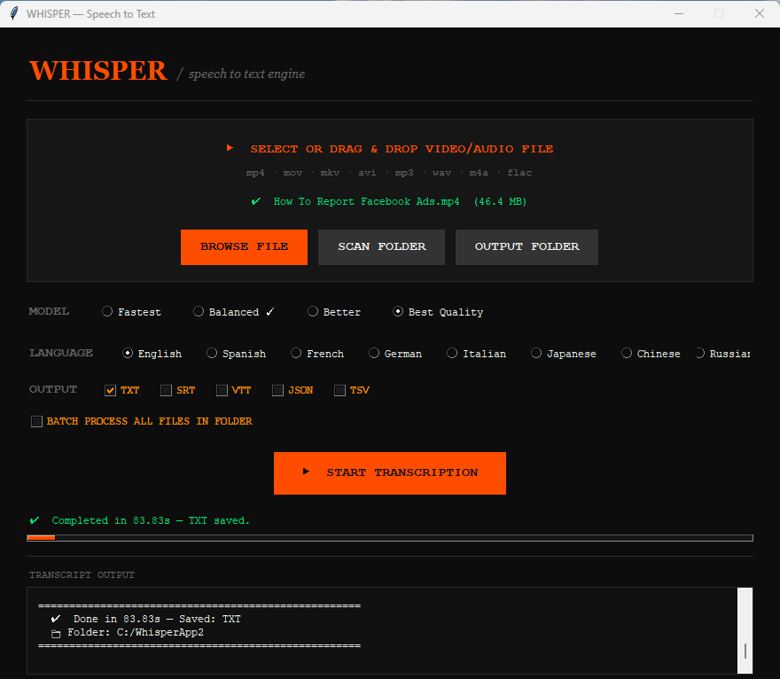

# 🎙️ Speech-to-Text Whisper GUI Python

# *Convert MP4 · MP3 · WAV · M4A · FLAC · MOV · AVI · MKV to Text & Subtitles*

**Turn any video or audio file into text, subtitles, or data — with one click!**

# 📸 Screenshot

  
   
  <em>Main application interface</em>

## 🎥 Complete Video Tutorial

  

  <b>▶️ Click the image above to watch the full tutorial</b>

- ✅ How to install Python & FFmpeg
- ✅ Setting up the project step by step
- ✅ Transcribing MP4/MP3 files
- ✅ Batch processing multiple files
- ✅ GPU acceleration setup (CUDA)
- ✅ Real-time demo with different file formats

# 📥 What can you transcribe?

| If you have... | You can get... |
|----------------|-----------------|
| 🎥 MP4 Video | 📝 Text transcript |
| 🎵 MP3 Audio | 🎬 SRT subtitles |
| 🎶 WAV Recording | 🌐 VTT web subtitles |
| 📀 M4A Podcast | 📊 JSON data |
| 🎼 FLAC Music | 📈 TSV for Excel |
| 🎬 MOV Video | ✅ All formats at once! |
| 🎞️ AVI Video | |
| 🗃️ MKV Video | |

# 🚀 One-click conversions

- **MP4 → TXT** : Extract text from YouTube videos, lectures, movies
- **MP3 → SRT** : Create subtitles for your podcast
- **WAV → JSON** : Get word-by-word timestamps
- **MOV → VTT** : Web-ready subtitles
- **Batch folder → All formats** : Process 100+ files overnight

# ✨ Features

- 🎯 Drag & Drop support
- 🚀 GPU (CUDA) acceleration
- 📁 Batch processing (entire folders)
- 🌍 8 languages support
- 📄 Multiple output formats (TXT, SRT, VTT, JSON, TSV)
- 🎨 Modern dark theme UI
- ⚡ Keyboard shortcuts

# 🎯 Supported Languages

| Language | Code | Language | Code |
|----------|------|----------|------|
| English | en | Spanish | es |
| French | fr | German | de |
| Italian | it | Japanese | ja |
| Chinese | zh | Russian | ru |

# 📦 Installation

# Prerequisites

- Python 3.8 or higher
- FFmpeg

### Step 1: Install FFmpeg

**Windows:**
winget install ffmpeg

**macOS:**
brew install ffmpeg

**Linux (Ubuntu/Debian):**
sudo apt update
sudo apt install ffmpeg

### Step 2: Clone Repository

git clone https://github.com/techpostdev/speech-to-text
cd speech-to-text

### Step 3: Install Python Packages

pip install -r requirements.txt

### Step 4: Run Application

python speech-to-text.py

### 🚀 GPU Acceleration (Optional)

For 10x faster transcription with NVIDIA GPU:

pip uninstall torch torchaudio
pip install torch torchaudio --index-url https://download.pytorch.org/whl/cu118

Verify GPU is working:
python -c "import torch; print(torch.cuda.is_available())"

## 🎮 How to Use

### Single File:
1. Click "BROWSE FILE" or Drag & Drop
2. Select Model (Tiny/Base/Small/Medium)
3. Select Language
4. Choose Output Formats
5. Click "START TRANSCRIPTION"

### Batch Processing:
1. Click "SCAN FOLDER"
2. Select folder with files
3. Check "BATCH PROCESS ALL FILES"
4. Click "START TRANSCRIPTION"

## ⌨️ Keyboard Shortcuts

| Shortcut | Action |
|----------|--------|
| Ctrl + O | Browse File |
| Ctrl + B | Scan Folder |
| Ctrl + Enter | Start Transcription |

## ❓ FAQ

**Q: "ffmpeg not found" error?**
A: Install FFmpeg (see installation steps above)

**Q: Slow transcription?**
A: First run downloads models. Enable GPU for faster processing.

**Q: "mel_filters.npz" error?**
A: Run pip install --upgrade openai-whisper

**Q: Can I transcribe 2-hour movies?**
A: Yes, use "Base" or "Tiny" model with 8GB+ RAM.

**Q: Does it work offline?**
A: Yes, after first model download (1-3GB).

## 🔧 Troubleshooting

| Problem | Solution |
|---------|----------|
| pip not found | Reinstall Python with PATH option |
| torch not found | Run pip install torch |
| CUDA out of memory | Use smaller model (Tiny/Base) |
| File not supported | Convert to MP3 or MP4 |
| Permission denied | Run as administrator |

## 📊 Model Comparison

| Model |       Speed      |     Accuracy     |  RAM     |      Best For            |
|-------|------------------|------------------|----------|--------------------------|
| Tiny  |   ⚡Fastest      |    70%          |  1GB      |     Testing             |
| Base  |  ⚡⚡Fast       |     85%          |  2GB      |     General Use         |
| Small |   ⚡Medium       |     90%         |   3GB     |     Important meetings  |
| Medium|   🐌 Slow        |     95%         |   5GB     |     Professional        |

## 🛣️ Roadmap

- [ ] Faster-Whisper support
- [ ] Speaker diarization
- [ ] DOCX export
- [ ] Auto language detection
- [ ] Real-time transcription

## 🤝 Contributing

1. Fork the repository
2. Create feature branch (git checkout -b feature/AmazingFeature)
3. Commit changes (git commit -m 'Add AmazingFeature')
4. Push to branch (git push origin feature/AmazingFeature)
5. Open a Pull Request

## 📝 License

MIT License - Free for personal and commercial use

## 👤 Author

**Tech Post**

- GitHub: @techpostdev
- Project Link: https://github.com/techpostdev/speech-to-text

## 🙏 Credits

- OpenAI Whisper
- PyTorch
- FFmpeg

## 📁 Project Structure
speech-to-text/
│
├── speech_to_text.py # Main application (run this)
├── requirements.txt # Python packages list
├── README.md # This file
├── LICENSE # MIT License
├── .gitignore # Git ignore rules
│
├── assets/ # Images folder
│ └── Screenshot_1.png # App screenshot
│
└── docs/ # Documentation folder
├── installation.md
├── usage.md
└── faq.md

⭐ Star this repository if you find it useful! ⭐

*Made with ❤️ for everyone*

